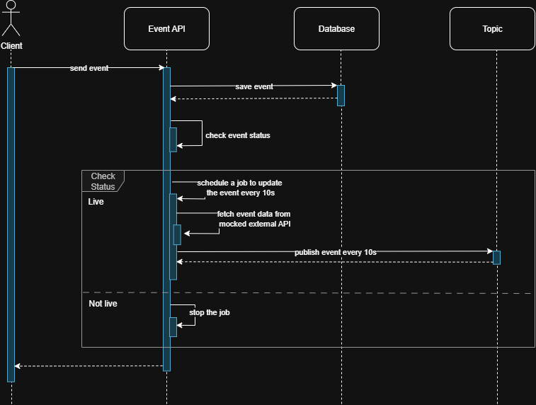

# Live Sports Events API

This project is a Spring Boot application for managing live sports events, featuring:
- RESTful API for event creation and updates
- Live event status updates using virtual threads
- Kafka integration for event publishing
- Embedded Kafka and Testcontainers for integration testing
- H2 in-memory database for development

## Data Flow

1. **Client** sends an HTTP request to the REST API (e.g., create/update event).
2. **Controller Layer** receives the request and calls the appropriate service.
3. **Service Layer** processes the business logic:
   - Saves/updates the event in the database.
   - If the event is live, starts a thread to periodically fetch live info.
   - Publishes event updates to Kafka.
4. **Repository Layer** persists event data in the H2 database.
5. **Kafka** receives event update messages on the `live-events` topic.
6. **Consumers** (other services or integration tests) can read event updates from Kafka.

## Sequence Diagram



## Requirements
- Java 21
- Gradle

## Running the Application

1. **Start Kafka (for local development):**
   You can use Docker:
   ```bash
   docker run -d --name zookeeper -p 2181:2181 zookeeper:3.7
   docker run -d --name kafka -p 9092:9092 --env KAFKA_ZOOKEEPER_CONNECT=zookeeper:2181 --env KAFKA_ADVERTISED_LISTENERS=PLAINTEXT://localhost:9092 --env KAFKA_LISTENERS=PLAINTEXT://0.0.0.0:9092 confluentinc/cp-kafka:7.5.0
   ```

2. **Run the application:**
   ```bash
   ./gradlew bootRun
   ```

3. **API Endpoints:**
   - `POST /v1/events` - Create or update an event
   - Kafka topic: `live-events` for event updates

4. **Swagger UI:**
   Visit `http://localhost:8080/swagger-ui.html` for API documentation.

## Testing

- Run all tests:
  ```bash
  ./gradlew test
  ```
- Integration tests use Embedded Kafka or Kafka Testcontainer.

## Configuration

- See `src/main/resources/application.yaml` for database and Kafka settings.

## Project Structure
- `src/main/java/com/example/sports/controller` - REST controllers
- `src/main/java/com/example/sports/service` - Business logic and live updates
- `src/main/java/com/example/sports/model` - JPA entities
- `src/main/java/com/example/sports/dto` - Data transfer objects
- `src/main/java/com/example/sports/repository` - Spring Data JPA repositories
- `src/test/java/com/example/sports/controller` - API and Kafka integration tests

## License
MIT
